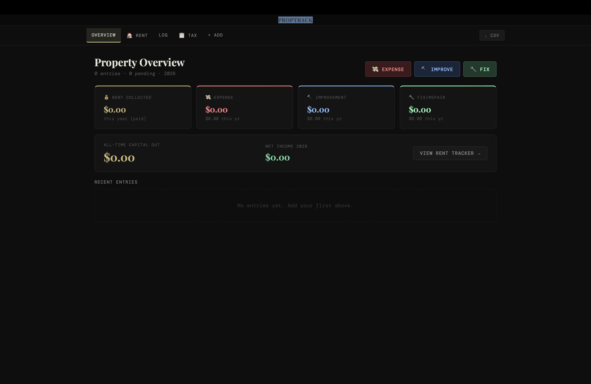

# PropTrack

A native macOS app for managing a rental property — tracking expenses, improvements, repairs, rent payments, and generating tax summaries.

Built with [Tauri](https://tauri.app) + React. Data saves locally to your Mac as plain JSON. No cloud, no subscriptions, no account required.



---

## Features

- **Expense tracking** — mortgage, insurance, utilities, property tax, HOA, lawn care, and more
- **Improvements log** — kitchen, bath, flooring, roof, HVAC, landscaping with capital vs. repair distinction
- **Fix & repair log** — plumbing, electrical, appliances, emergency repairs with status tracking (pending / in-progress / complete)
- **Rent tracker** — month-by-month calendar grid, paid/late/partial/unpaid status, tenant info
- **Tax summary** — Schedule E-style breakdown of gross rent, deductible expenses, repairs, and capital improvements by year
- **CSV export** — native save dialog exports all entries + rent records, filterable by year (for your CPA)
- **Receipt URLs** — attach a Google Drive or Imgur link to any entry and view inline
- **Vendor tracking** — contractor names, invoice numbers, and notes on every entry
- **Persistent storage** — data lives on disk at `~/Library/Application Support/com.proptrack.app/proptrack-data.json`

---

## Stack

| Layer | Technology |
|---|---|
| Framework | [Tauri v1](https://tauri.app) |
| Frontend | React 18 + Vite 7 |
| Backend | Rust (minimal — just Tauri boilerplate) |
| Storage | Local JSON file via Tauri `fs` API |
| Styling | Inline CSS + Google Fonts (DM Mono, Playfair Display) |

---

## Prerequisites

- macOS 10.15 (Catalina) or later
- [Rust](https://rustup.rs) — `curl --proto '=https' --tlsv1.2 -sSf https://sh.rustup.rs | sh`
- Node.js 18+ — `brew install node`
- Xcode Command Line Tools — `xcode-select --install`

---

## Getting Started

```bash
# 1. Clone the repo
git clone https://github.com/yourname/proptrack.git
cd proptrack

# 2. Install JS dependencies
npm install

# 3. Generate app icons
python3 generate_icon.py

# 4. Start in dev mode (hot reload)
npm run tauri dev
```

First run takes 3–5 minutes while Rust compiles. Subsequent runs are fast.

---

## Building the .app

```bash
npm run tauri build
```

Output locations:
```
src-tauri/target/release/bundle/macos/PropTrack.app   ← drag to /Applications
src-tauri/target/release/bundle/dmg/PropTrack_1.0.0_aarch64.dmg
```

> **Note:** The app isn't notarized (requires a paid Apple Developer account). On first open, right-click → Open → Open anyway to bypass Gatekeeper.

---

## Project Structure

```
proptrack/
├── src/
│   ├── main.jsx              # React entry point
│   └── App.jsx               # All UI, state, and logic
├── src-tauri/
│   ├── src/main.rs           # Rust entry point (minimal)
│   ├── tauri.conf.json       # App config — window size, fs permissions, bundle settings
│   ├── Cargo.toml            # Rust dependencies
│   └── icons/                # App icons (generated by generate_icon.py)
├── generate_icon.py          # Generates all icon sizes + .icns from scratch
├── index.html                # HTML shell
├── package.json
├── vite.config.js
└── SETUP.md                  # Detailed setup + troubleshooting
```

---

## Data

All data is stored locally at:
```
~/Library/Application Support/com.proptrack.app/proptrack-data.json
```

The file is plain JSON — easy to inspect, back up, or migrate. To back up:
```bash
cp ~/Library/Application\ Support/com.proptrack.app/proptrack-data.json ~/Desktop/proptrack-backup.json
```

---

## Customizing the Icon

Edit the geometry values in `generate_icon.py` then rerun:
```bash
python3 generate_icon.py
npm run tauri build
```

The script generates all required PNG sizes and a proper `.icns` using macOS's built-in `iconutil`.

---

## Troubleshooting

**`command not found: cargo`**
```bash
source "$HOME/.cargo/env"
```

**`npm install` peer dependency errors**
```bash
npm install --legacy-peer-deps
```

**App opens but data doesn't persist after quit**
Check that `tauri.conf.json` has `createDir` and `exists` in the `fs` allowlist, and that `App.jsx` uses `appDataDir()` for the absolute path rather than `BaseDirectory.AppData`.

**CSV export does nothing**
The export uses Tauri's native save dialog — make sure the `exportCSV` function is `async` and calls are prefixed with `await` or `.catch(console.error)`.

**"App can't be opened" on first launch**
Right-click the `.app` → Open → Open anyway. This bypasses Gatekeeper for unsigned apps.

See `SETUP.md` for the full setup walkthrough and additional troubleshooting.

---

## License

MIT
